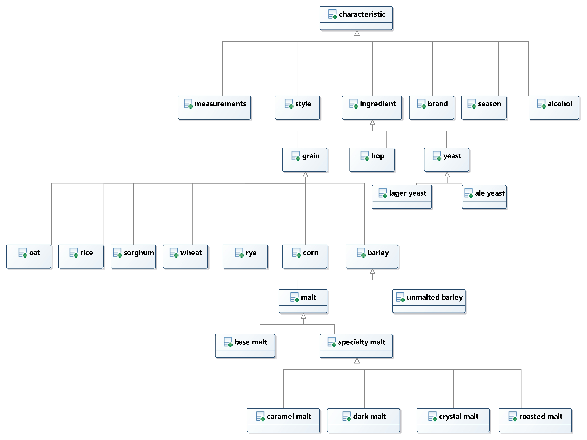

[Concept Map](#conceptual-model) | [Ontology File](#ontologies)

## Conceptual Model

#### Overview
The conceptual model for the ontology developed in this project is shown below. The figure presents the general idea of the ontology. The class beer is the main one in this diagram and the entire structure is built around it. First, note that it has many subclasses which may end up representing the different styles, such as a Stout or an English India Pale Ale. Furthermore, note that every individual that is classified as a Beer will have a set of attributes called Characteristic. This class will be responsible to group all attributes that help classifying a beer, such as alcohol content, color, bitterness, ingredients and brand. In addition, also note that Beer is is produced by some Brewery and, therefore, they are connected by an appropriate Object Property. Finally, notice that the User is connected to beers by its Profile. The User's Profile has a record of structured data that comprises Preference, which indicates Beers and Characteristics that are preferred by that specific User. The next sections provide details about other parts of the conceptual model of this ontology.

#### Beer Characteristics
Beer classification involves the attributes that are intrinsic and extrinsic to a certain beer. In order to address this issue, the class Beer has an attribute called Characteristic which is responsible for summarizing all important features that are related to a specific beer. For example, beer is made of a set of ingredients. Those ingridients are necessary for different types of classification such as Wheat beers which have, obviously, wheat as an ingredient. Moreover, each beer has a specific color, bitterness and alcohol content. These characteristic are also taken into account and, since they are measured with some scale, they are subclasses of a Quantity Value. Note that the characteristic color, for instance, is measured through the standard reference method while alcohol content is measured by alcohol by volume and bitterness is measured using the international bitterness unit. An overview of beer characteristics and its association with other attributes is shown in the two figures below.

#### User
The person or organization that uses the application will have their role in the application connected to a User Profile. This is needed so the ontology-enabled application to assess the singularities of each user in order to provide better beer suggestions for each individual. Therefore, the User Profile is linked to two main classes: Preferences and Search History. The former is a class that is responsible for storing beers and characteristics that are preferred by the user. The latter is a class related to storing the search history of the user. This last piece of information can help a user to explore what people is looking for in a particular Brewery, for example. The diagram shown below summarizes the classes and properties related to the User.

## Ontologies

**Links:**
[main-ontology](https://raw.githubusercontent.com/tetherless-world/ontology-engineering/beer-advisor/oe2020/beer-advisor/archived/OE_8_beer-advisor.rdf)
[individuals-ontology](https://raw.githubusercontent.com/tetherless-world/ontology-engineering/beer-advisor/oe2020/beer-advisor/archived/OE_8_beer-advisor-individuals.rdf)

**View the ontology documentation at:**

## Previous Versions of Ontologies
**Link:**
[ontology-version1](https://raw.githubusercontent.com/tetherless-world/ontology-engineering/beer-advisor/oe2020/beer-advisor/archived/OE_7_beer-advisor.rdf)